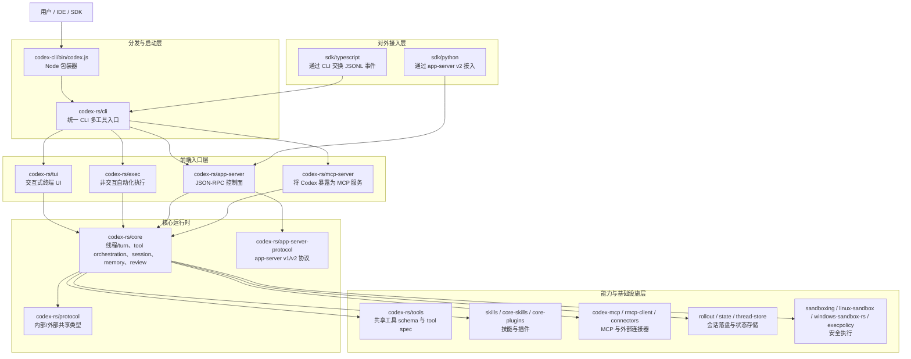
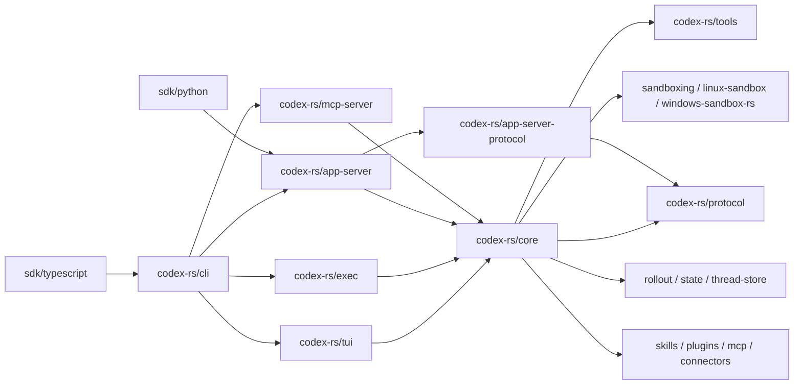
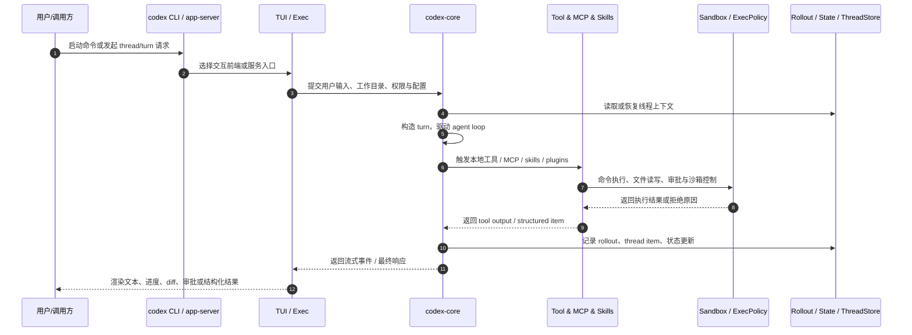

# Codex 仓库架构与设计分析

本文基于当前仓库中的真实实现与文档进行归纳，重点回答三个问题：

1. 这个仓库的核心能力分别落在哪些层。
2. 各个 component 之间如何协作，把一个 coding agent 变成可交互、可扩展、可服务化的产品。
3. 这个项目背后的设计取舍是什么，面试时应如何解释。

## 一、整体判断

`codex` 不是一个单一 CLI 程序，而是一个 **以 Rust 原生 agent runtime 为核心、同时支持 TUI、非交互执行、IDE 控制面和 SDK 接入的多前端平台型仓库**。

从顶层结构看，它可以分成四个大块：

- `codex-cli/`：npm 分发包装层，负责把 Node 入口转发到平台对应的原生二进制。
- `codex-rs/`：核心 Rust workspace，承载 CLI、TUI、exec、app-server、protocol、sandbox、tools、state 等主要实现。
- `sdk/`：对外嵌入能力，当前至少有 TypeScript SDK 和 Python SDK。
- `docs/`、`scripts/`、`tools/`：工程化支撑，包括安装、配置、协议、格式化、schema 生成和 lint 工具。

它的设计重心不是“把模型塞进终端”，而是把以下几个维度同时做成稳定能力：

- 统一的 agent loop
- 统一的工具调用与权限模型
- 统一的线程/turn/item 持久化模型
- 统一的协议边界，便于 IDE 和 SDK 复用
- 跨平台安全执行与沙箱

## 二、整体分层架构

### 分层解读

1. **分发层**只解决“怎么把正确的二进制跑起来”。`codex-cli` 本身不承载核心业务。
2. **前端入口层**解决“用什么形态消费 agent”。这里至少有 TUI、headless exec、app-server 和 MCP server 四类入口。
3. **核心运行时**解决“agent 究竟如何运转”。`codex-core` 是主业务中心，协议 crate 则给边界稳定性。
4. **能力与基础设施层**解决“工具、状态、安全、扩展如何沉淀为复用资产”。
5. **对外接入层**说明仓库目标不是单一 CLI，而是可嵌入别的产品和脚本体系。

## 三、关键组件作用与关系

### 1. `codex-cli`：分发包装，而不是主业务层

`codex-cli/bin/codex.js` 的职责很清晰：

- 根据当前平台和架构解析目标 triple。
- 找到对应平台包中的原生 `codex` 二进制。
- 补齐运行时 PATH、转发信号、把参数原样传给 Rust 可执行文件。

这意味着 npm 包的主要价值是 **安装与分发体验统一**，而不是在 Node 层实现 agent 逻辑。

### 2. `codex-rs/cli`：统一命令入口

`codex-rs/cli/src/main.rs` 是真正的多工具入口。它把这些能力收敛成一个 CLI：

- 默认交互模式
- `exec` 非交互运行
- `review`
- `mcp` / `mcp-server`
- `app-server`
- `sandbox`
- `plugin`、`cloud`、`responses` 等辅助能力

这一层的价值是 **把不同消费方式统一在一个产品入口之下**。用户感知到的是一个 `codex`，内部则分发到不同前端或服务模式。

### 3. `codex-rs/tui`：交互式前端

`codex-rs/tui` 基于 `ratatui` 和 `crossterm`。它不是把所有逻辑都塞进 UI，而是主要做：

- 输入与快捷键处理
- 历史与线程导航
- 流式事件渲染
- 与 app-server / core 事件适配
- 交互反馈、审批提示、状态展示

从 `tui/src/app.rs` 可见，这一层已经被切成多个子模块，例如 `event_dispatch`、`thread_routing`、`session_lifecycle`、`app_server_adapter`，说明仓库在有意识地把 UI 编排与业务核心分开。

### 4. `codex-rs/exec`：自动化执行前端

`codex-rs/exec` 负责非交互执行，是自动化场景的主要入口，例如 CI、脚本、批处理和 SDK 内部调用。

它与 TUI 的共同点是都依赖同一个 core；不同点是：

- TUI 关注人机交互和长会话体验。
- Exec 关注稳定输出、结构化事件、无界面自动运行。

这体现了一个重要设计：**前端差异不应复制 agent 核心，只应改变呈现与交互方式。**

### 5. `codex-rs/core`：业务核心

`codex-rs/core/src/lib.rs` 暴露了这个仓库最关键的概念群：

- `ThreadManager`、`CodexThread`：线程与会话生命周期
- session / rollout：上下文、事件与落盘
- tools / function_tool / unified_exec：工具调用编排
- skills / plugins / connectors / mcp：扩展与外部能力接入
- sandboxing / shell / exec_policy：执行安全
- memories / memory_trace：记忆系统
- review_format / review_prompts：审查模式
- goals / tasks：面向目标和任务的长期状态

可以把 `codex-core` 理解成 **agent runtime 内核**。它负责把“用户输入、模型输出、工具调用、权限、状态、外部资源”组织成可持续运行的线程系统。

### 6. `protocol` 与 `app-server-protocol`：边界建模

这一层是仓库设计里最值得强调的地方。

#### `codex-rs/protocol`

- 保存内部与外部都需要共享的类型。
- 目标是“轻依赖、弱业务”，尽量不夹带 material business logic。

#### `codex-rs/app-server-protocol`

- 明确建模 `app-server` 的 v1/v2 JSON-RPC 协议。
- 提供 schema 导出与 TypeScript 生成能力。
- 把 wire format、实验 API 标记、v2 演进路径沉淀成稳定边界。

这说明 `codex` 不是简单地把 CLI 暴露给 IDE，而是在主动建设一个 **服务化控制面协议**。

### 7. `codex-rs/app-server`：富客户端控制面

`codex-rs/app-server/README.md` 说明得很明确：它是 Codex 驱动 VS Code 等富客户端的接口层。

它提供的不是一组零散命令，而是一套围绕线程、turn、item 的控制平面：

- `thread/start`、`thread/resume`、`thread/fork`
- `turn/start`、`turn/interrupt`、`turn/steer`
- `command/exec`、`fs/*`
- `skills/*`、`plugin/*`、`mcpServer/*`
- 实时音频、设备签名、配置读写、feedback 上传等

这使得 Codex 可以同时服务：

- 终端交互
- IDE 扩展
- Python SDK
- 未来更多 GUI 或托管端

### 8. `codex-rs/tools`：从 `core` 外提的共享工具模型

`codex-rs/tools/README.md` 直接写明了目标：把共享的 tool schema、Responses API tool primitives 和解析逻辑从 `codex-core` 中逐步抽离。

它代表了仓库当前的一个重要演进方向：

- `codex-core` 仍然很大。
- 但项目没有接受“大核心永远膨胀”这个现实。
- 相反，它在持续把可复用、低耦合的工具模型迁移到独立 crate。

这是一种比较成熟的治理方式：**先承认核心变大，再通过可回顾的小步迁移把边界拉清。**

### 9. 持久化与状态层

这一层主要包括：

- `codex-rs/rollout`
- `codex-rs/state`
- `codex-rs/thread-store`

它们共同支撑：

- 线程历史与会话回放
- resumable session
- 元数据与状态落盘
- app-server 的 thread/turn/item 抽象

从架构角度看，这说明 Codex 的状态模型不是“单次 prompt-response”，而是 **可恢复、可分叉、可审计的 thread system**。

### 10. Sandbox 与执行安全层

从 `core/README.md` 与工作区 crate 清单可以看到，仓库把不同平台的安全执行视为一等能力：

- macOS：Seatbelt 路径
- Linux：Landlock / bubblewrap 路径
- Windows：受限 token / sandbox 路径
- `execpolicy`：额外执行策略治理

这层存在的意义不是“补充一个安全选项”，而是：**agent 产品天然会执行命令、读写文件、访问网络，安全边界必须前置为架构层，而不是后补的 feature。**

### 11. SDK：把仓库从产品做成平台

当前仓库已经有两条明显的对外接入路线：

- `sdk/typescript`：通过拉起 `codex` CLI，用 JSONL 事件和 stdin/stdout 交互。
- `sdk/python`：通过 `codex app-server` 的 JSON-RPC v2 接入。

这两个 SDK 非常能说明设计思路：

- TypeScript 侧更贴近本地 CLI 嵌入。
- Python 侧更贴近服务协议与结构化 API。

换句话说，仓库内部同时保留了 **产品入口** 和 **平台入口**。

## 四、核心组件关系图

### 关系总结

- `cli` 是总入口，负责模式分发。
- `tui`、`exec`、`app-server` 是不同消费形态的前端。
- `core` 是共享业务核心。
- `protocol` 和 `app-server-protocol` 是边界稳定器。
- `tools`、`sandbox`、`state`、`skills/plugins/mcp` 是可复用能力层。
- `sdk` 说明平台化是明确目标，不是偶然附带。

## 五、一次请求的典型数据流

这个流程背后的抽象重点有两个：

- 所有入口最终都落回同一个 `core` 线程模型。
- 所有副作用都被努力纳入统一的 tool / sandbox / state 框架，而不是散落在 UI 或脚本层。

## 六、整个项目的设计思路总结

### 1. 平台化优先，而不是单前端优先

很多 agent CLI 项目会先把 REPL 做强，再考虑 IDE 和 SDK。Codex 的路线更像：

- 用原生 runtime 先收敛核心能力。
- 再让 TUI、exec、app-server、SDK 共享这套能力。

这使它更容易从“一个终端工具”演进到“一个 agent 平台”。

### 2. 协议边界优先

`protocol` 与 `app-server-protocol` 的存在，说明项目非常重视：

- 类型一致性
- 向后兼容
- schema 导出
- 多客户端复用

这类边界一旦立住，IDE、SDK 和 server mode 才能真正独立演进。

### 3. 安全执行是架构问题，不是后置补丁

在 agent 产品里，“能执行命令”既是能力核心，也是最大风险源。Codex 把沙箱、exec policy、审批模型和平台差异都下沉成基础设施，这个取舍很重，但方向是正确的。

### 4. 接受 `core` 膨胀现实，同时持续拆分

仓库显然知道 `codex-core` 已经很大，所以通过 `codex-tools`、独立 protocol crate、独立 state/store crate、独立 sandbox crate 持续迁移边界。这说明团队不是被动容忍技术债，而是在做结构化治理。

### 5. 数据模型从一开始就面向长期会话

thread / turn / item、rollout、resume、fork、archive 这些概念说明 Codex 不是把 agent 当成 stateless chat，而是当成长期协作对象。这更符合真实工程场景。

## 七、从面试视角可能被问到的问题与回答

### 1. 为什么要拆成这么多 Rust crate，而不是做成一个大二进制？

因为这个仓库不只有一个终端入口，还要同时支持 TUI、exec、app-server、MCP server、SDK 和跨平台安全执行。拆 crate 的目标不是形式上的微模块，而是把协议、沙箱、状态、工具模型、前端入口等边界稳定下来，降低后续演进耦合。

### 2. `codex-cli` 和 `codex-rs/cli` 的职责为什么分两层？

`codex-cli` 解决跨平台安装与分发，`codex-rs/cli` 解决业务入口统一。前者偏 packaging，后者偏 product runtime。这样 npm 安装体验可以保留，但核心逻辑仍然由原生二进制掌控。

### 3. 为什么需要 `app-server`，直接让 IDE 调用 CLI 不行吗？

直接调用 CLI 可以做最简单集成，但很难稳定支持线程管理、流式事件、文件操作、审批、插件、技能、实时能力和协议版本演进。`app-server` 把这些能力收敛成 JSON-RPC 控制面，IDE 和 SDK 都能在稳定协议上工作。

### 4. `protocol` 和 `app-server-protocol` 为什么要分开？

因为两者职责不同。`protocol` 更偏共享基础类型，避免带入过多业务逻辑；`app-server-protocol` 则是面向外部控制面协议的 wire contract，包含 v1/v2、schema 导出和实验 API 管理。分开以后，内部共享类型和外部协议演进就不会完全绑死。

### 5. `codex-core` 已经很大了，这算不算架构问题？

算，但更准确地说是演进中的平台核心聚合问题。仓库已经在用 `codex-tools` 等独立 crate 逐步外提低耦合能力，说明它不是忽视问题，而是在做渐进式解耦。对于这样一个高复杂度 agent runtime，先收敛核心再拆分，比过早抽象更稳。

### 6. TUI 和 Exec 如何共享逻辑而不互相污染？

靠的是前端与核心分层。TUI 负责 UI 渲染、交互和事件适配；Exec 负责无界面输出和自动化运行；真正的线程模型、工具编排、状态落盘和安全执行都在 `codex-core`。这避免了两个前端分别维护一套 agent 行为。

### 7. 这个项目的工具系统为什么值得单独设计？

因为 agent 产品的真正可用性不由聊天框决定，而由工具调用决定。工具系统需要统一 schema、权限、输出格式、兼容 Responses API/MCP、支持本地命令与外部资源，还要能被不同前端复用，所以必须沉到共享层。

### 8. 为什么要把 thread / turn / item 设计得这么细？

因为这让系统具备恢复、分叉、审计、流式呈现和服务化的基础。只有把对话拆成结构化 item，才能同时支持 CLI 展示、IDE 事件流、review、resume、rollback 和状态分析。

### 9. 这个项目最重的技术难点是什么？

不是单纯接模型 API，而是把“模型 + 工具 + 状态 + 安全 + 多前端 + 多平台”统一到一个一致 runtime。尤其是跨平台沙箱、协议兼容、长会话持久化和工具生态接入，都是高复杂度问题。

### 10. 为什么同时保留 CLI 驱动 SDK 和 app-server 驱动 SDK？

因为两类场景诉求不同。CLI 驱动更适合本地嵌入和快速落地；app-server 驱动更适合结构化、长期维护、可扩展控制面。两条路并存，说明项目在兼顾开发者易用性与平台长期性。

### 11. 如果继续演进，这个仓库最值得优化的方向是什么？

一是继续控制 `codex-core` 膨胀，把低耦合逻辑迁到共享 crate；二是继续强化 app-server 作为统一控制面，使 TUI、IDE、SDK 在协议层进一步收敛；三是让工具、技能、插件和审批能力在 UI 层更可观察。

### 12. 用一句话概括这个项目的设计思路？

它本质上是在构建一个 **可交互、可自动化、可服务化、可扩展且安全可控的本地 agent runtime 平台**，CLI 只是它最直接的一层外壳。

## 八、结论

如果只看表面，`codex` 像是一个 CLI 工具仓库；如果从架构看，它更接近一个 **以 Rust native runtime 为核心、围绕统一线程模型与协议边界构建的 agent 平台**。

这个判断背后最关键的证据有四个：

- 有多个前端入口，但共享 `codex-core`。
- 有明确的协议建模，而不是仅靠命令行参数传递能力。
- 有独立的安全执行与状态持久化体系。
- 已经存在对外 SDK，且接入路径并不相同。

也正因为如此，理解这个仓库时不应只盯着 `tui` 或 `cli`，而应该把它看作“runtime、protocol、frontends、capabilities、SDK”五层协同的系统。
